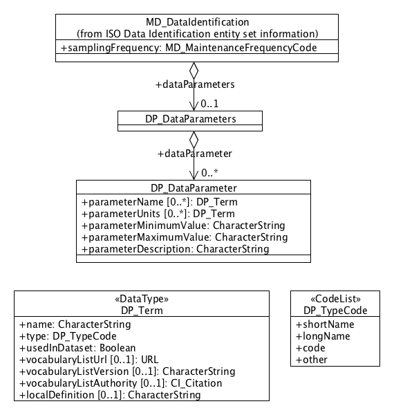

.. _dataParameters:

Data Parameters (mcp:dataParameters)
====================================

Rationale
---------

ISO19115 has classes for describing the data parameters of coverages (continuously varying data usually represented by grids) and features (usually discrete data represented as points, lines and polygons etc) in the Content Information package (see section A.2.8 of the ISO19115 standard). However, the package does not provide:

- a simple, unified description of data parameters. The metadata author is forced instead to split the description of data parameters between a class for coverages and a separate, related standard for features (ISO19110)
- a simple way of handling the different aliases that often need to be described when entering metadata about data parameter names
- vocabulary support for looking up data parameter names where these names have been standardized

The intention of this new package is to address the first two shortcomings and provide a basis for the third (vocabulary support) when vocabulary services that provide these parameters are standardized and widely available.

UML
---

*UML Diagram of DataParameters package*

Data Dictionary
---------------

.. index:: mcp:dataParameters
.. index:: mcp:DP_DataParameters
.. index:: mcp:dataParameter
.. index:: mcp:DP_DataParameter
.. index:: mcp:parameterName
.. index:: mcp:parameterUnits
.. index:: mcp:parameterMinimumValue
.. index:: mcp:parameterMaximumValue
.. index:: mcp:parameterDescription

===  ===========================  ====================================================================================  ========================  ===============  ==================================  ===============================
No.  Name/Role Name               Definition                                                                            Condition/ Obligation     Max. Occurrence  Data Type                           Domain
===  ===========================  ====================================================================================  ========================  ===============  ==================================  ===============================
940  DP_DataParameters            Container for description of data set data parameters                                 Note 1                    Note 2           Aggregated Class                    Line 68                        
941  DP_DataParameter             Container for description of a data set parameter                                     Note 1                    Note 2           Class                               Lines 942-946
942  parameterName                Name of Parameter                                                                     M                         N                Class                               DP_InfoType        
943  parameterUnits               Units of Parameter                                                                    M                         N                Class                               DP_InfoType        
944  parameterMinimumValue        Minimum Value of Parameter                                                            O                         1                CharacterString                     FreeText
945  parameterMaximumValue        Maximum Value of Parameter                                                            O                         1                CharacterString                     FreeText
946  parameterDescription         Parameter Description                                                                 O                         1                CharacterString                     FreeText
===  ===========================  ====================================================================================  ========================  ===============  ==================================  ===============================

.. include:: ../common_notes.rst

.. index:: mcp:name
.. index:: mcp:type
.. index:: mcp:vocabularyListUrl
.. index:: mcp:vocabularyListVersion
.. index:: mcp:vocabularyListAuthority
.. index:: mcp:localDefinition
.. index:: mcp:DP_TypeCode

===  ===========================  ====================================================================================  ========================  ===============  ==================================  ===============================
No.  Name/Role Name               Definition                                                                            Condition/ Obligation     Max. Occurrence  Data Type                           Domain
===  ===========================  ====================================================================================  ========================  ===============  ==================================  ===============================
947  DP_InfoType                  Parameter Name or Unit Information                                                    Note 1                    Note 2           Class <<DataType>>                  Lines 948-953
948  name                         Name of Parameter or Unit (depending on parent)                                       M                         1                CharacterString                     FreeText
949  type                         Type of Parameter name or Unit name                                                   M                         1                CodeList                            DP_TypeCode
950  vocabularyListURL            URL of the parameter/unit vocabulary list/service that includes this name             O                         1                Class                               URL         
951  vocabularyListVersion        Version of the parameter/unit vocabulary list/service that includes this name         O                         1                CharacterString                     FreeText
952  vocabularyListAuthority      Citation of authority regulating or managing vocabulary list specified at 950         O                         1                Class                               CI_Citation 
953  localDefinition              Definition of the parameter/unit name if not available from vocabulary list/service   O                         1                CharacterString                     FreeText
===  ===========================  ====================================================================================  ========================  ===============  ==================================  ===============================

.. include:: ../common_notes.rst

XML Example
-----------

An XML example of the data parameter package:

::
 
  <mcp:dataParameters>
    <mcp:DP_DataParameters>
      <mcp:dataParameter>
        <mcp:DP_DataParameter>
          <mcp:parameterName>
            <mcp:DP_ParameterName>
              <mcp:name>
                <gco:CharacterString>t</gco:CharacterString> 
              </mcp:name> 
              <mcp:type>
                <mcp:DP_TypeCode 
            codeList="http://bluenet3.antcrc.utas.edu.au/mcp-1.4/resources/Codelist/gmxCodelists.xml#DP_TypeCode" 
            codeListValue="shortName">shortName</mcp:DP_TypeCode> 
              </mcp:type> 
              <mcp:usedInDataset>
                <gco:Boolean>1</gco:Boolean> 
              </mcp:usedInDataset> 
              <mcp:vocabularyListURL>
                <gmd:URL>http://www.imos.org.au/vocabserver?code=temperature&vocab=oceanography</gmd:URL> 
              </mcp:vocabularyListURL> 
              <mcp:vocabularyListVersion>
                <gco:CharacterString>3.6</gco:CharacterString> 
              </mcp:vocabularyListVersion> 
            </mcp:DP_ParameterName> 
          </mcp:parameterName> 
          <mcp:parameterUnit>
            <mcp:DP_ParameterUnit>
              <mcp:name>
                <gco:CharacterString>degrees celsius</gco:CharacterString> 
              </mcp:name> 
              <mcp:type>
                <mcp:DP_TypeCode 
            codeList="http://bluenet3.antcrc.utas.edu.au/mcp-1.4/resources/Codelist/gmxCodelists.xml#DP_TypeCode"
            codeListValue="longName">longName</mcp:DP_TypeCode> 
              </mcp:type> 
              <mcp:usedInDataset>
                <gco:Boolean>1</gco:Boolean> 
              </mcp:usedInDataset> 
              <mcp:vocabularyListURL>
                <gmd:URL>http://www.imos.org.au/vocabserver?code=degreescelsius&vocab=uom</gmd:URL> 
              </mcp:vocabularyListURL> 
              <mcp:vocabularyListVersion>
                <gco:CharacterString>4.5</gco:CharacterString> 
              </mcp:vocabularyListVersion> 
            </mcp:DP_ParameterUnit>
          </mcp:parameterUnit> 
          <mcp:parameterMinimumValue>
            <gco:CharacterString>0.1</gco:CharacterString> 
          </mcp:parameterMinimumValue> 
          <mcp:parameterMaximumValue>
            <gco:CharacterString>22.5</gco:CharacterString> 
          </mcp:parameterMaximumValue> 
          <mcp:parameterDescription>
            <gco:CharacterString>The temperature observed by the CTD on its depth profile</gco:CharacterString> 
          </mcp:parameterDescription> 
        </mcp:DP_DataParameter> 
      </mcp:dataParameter> 
    </mcp:DP_DataParameters> 
  </mcp:dataParameters>

Metadata about this package
---------------------------

- **Proposer**: BlueNet Project (Kate Roberts)
- **Date proposed**: 2010
- **Date accepted by MCP Governance Committee**: 2010
- **MCP Version**: 1.4 onwards

