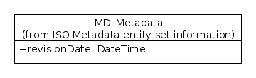

.. _revisionDate:

Metadata Revision Date (mcp:revisionDate)
=========================================

Rationale
---------

ISO19115 defines a mandatory dateStamp element (see data dictionary in section B.2.1 of the ISO19115 standard document) as 'the date that the metadata was created'. There is no element in ISO19115 that can capture the date (and time) of subsequent updates to the metadata. The MCP defines a revisionDate element that can capture this information.

UML
---

*UML Diagram showing extension to ISO Metadata Entity Element to include revisionDate*

Data Dictionary
---------------

.. index:: mcp:revisionDate

===  =================  ==============================================  ======================  ===============  ============  ==========================
No.  Name/Role Name     Definition                                      Condition/Obligation    Max. Occurrence  Data Type     Domain
===  =================  ==============================================  ======================  ===============  ============  ==========================
900  revisionDate       date and time that the metadata was revised     M                       1                Class         DateTime (ISO19115 B.4.2)
===  =================  ==============================================  ======================  ===============  ============  ==========================

XML Example
-----------

::

 <mcp:MD_Metadata (...)>
   (...)
   <mcp:revisionDate>
     <gco:Date>2011-05-18</gco:Date>
   </mcp:revisionDate>
 </mcp:MD_Metadata>

Metadata about this element
---------------------------

- **Proposer**: AODCJF Technical Committee
- **Date confirmed by MCP Governance Committee**: 2006
- **Included in MCP Version**: 1.2 onwards

