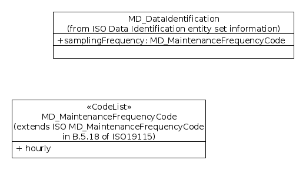

.. _samplingFrequency:

Data Sampling Frequency (mcp:samplingFrequency)
===============================================

Rationale
---------

ISO19115 has a data identification class that capture metadata about a data set or resource. The class does not include information about the frequency with which a data resource has been sampled. The MCP defines a samplingFrequency element that can capture this information. It is included as an extension of the data identification class and reuses an extension of the controlled vocabulary provided by the MD_MaintenanceFrequency code list (see section B.5.18 in ISO19115 and :ref:`MD_MaintenanceFrequencyCode`).

UML
---

*UML Diagram showing extension to ISO Identification Information Element to include samplingFrequency*

Data Dictionary
---------------

.. index:: mcp:samplingFrequency
.. index:: gmd:MD_MaintenanceFrequencyCode

===  =================  ==========================================================  ======================  ===============  ============  ==========================================
No.  Name/Role Name     Definition                                                  Condition/Obligation    Max. Occurrence  Data Type     Domain
===  =================  ==========================================================  ======================  ===============  ============  ==========================================
930  samplingFrequency  Describes the frequency with which the resource is sampled  O                       1                Class         MD_MaintenanceFrequencyCode (B.5.18)
===  =================  ==========================================================  ======================  ===============  ============  ==========================================

XML Example
-----------

::

 <mcp:MD_DataIdentification gco:isoType="gmd:MD_DataIdentification">
   (...)
   <mcp:samplingFrequency>
     <gmd:MD_MaintenanceFrequencyCode 
        codeList="http://bluenet3.antcrc.utas.edu.au/mcp-1.4/schema/resources/Codelist/gmxCodelists.xml#MD_MaintenanceFrequencyCode" 
        codeListValue="annually">annually</gmd:MD_MaintenanceFrequencyCode>
    </mcp:samplingFrequency>
  </mcp:MD_DataIdentification>

Metadata about this element
---------------------------

- **Proposer**: AODCJF Technical Committee
- **Date confirmed by MCP Governance Committee**: 2006
- **Included in MCP Version**: 1.2 onwards

