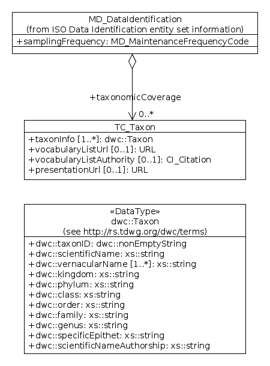

.. _taxonomicCoverage:

Taxonomic Coverage (mcp:taxonomicCoverage)
==========================================

Background
----------

Metadata records utilising the MCP which describe biological datasets should ideally be able to encode their taxonomic coverage in a consistent way so as to support predictable metadata and data search, filtering and aggregation operations, and also (where possible) navigation through a consistent hierarchical (tree) structure to find or group metadata records of interest. Currently, neither the base ISO19115 metadata standard or the Marine Community Profile support such a feature, although one such has been proposed as an extension to ISO19115 by the U.S. NBII (National Biological Information Infrastructure), see NODC, 2012. Meanwhile Simon Pigot of CSIRO Marine and Atmospheric Research has independently implemented an experimental extension to the MCP for embedding taxonomic information into MCP records. This extension was developed for the Atlas of Living Australia (ALA) and incorporates information supplied from the ALA-sponsored National Species Lists (NSL) project based at the Australian National Botanic Gardens (see Belbin & Pigot, 2010). 

The purpose of this section of the MCP manual is to:

- outline the requirements for taxonomic coverage data in the Marine Community
- briefly examine the current schemas used for taxonomic coverage data 
- identify and catalog the relevant services that can deliver this information to the Marine Community
- develop and refine the experimental extension to the MCP so that it can be adopted as part of the MCP

Requirements
------------

The requirement addressed herein is to propose a standardised way for representation of taxonomic coverage of a dataset in a metadata record. It is recognised that such coverage could comprise a single or multiple species names, or possibly names at a higher taxonomic level such as genus, family, or higher taxonomic ranks such as order, class, phylum or kingdom. For example datasets on fishes might comprise multiple fish species (up to 31,000 worldwide, 5,000 in the Australian region) right down to a single species, while for insects (admittedly not marine but in principle should be modelled according to the same approach) the numbers are larger again (maybe 1m global, 62,000 presently known Australian), refer Chapman, 2009. Clearly such large numbers of species would never be separately itemised in a metadata record, but conceivably a dataset comprising tens to possibly hundreds of different species may require to be described where such an approach might be desirable.

In the world of scientific communication the standard currency for species and other ranks is the **scientific name** of the organism, which is either a binomial (genus+species) at species rank (example: “*Homo sapiens*” for humans, “*Physeter macrocephalus*” for the sperm whale), or a uninominal at higher ranks (there are some exceptions such as subgenera but these can be ignored for present purposes) – examples for the sperm whale being the **taxonomic hierarchy** or nested set Animalia (kingdom) > Chordata (phylum) >  Mammalia (class) > Cetacea (order) > Physeteridae (family) > *Physeter* (genus) > *Physeter macrocephalus* (species) (note by convention, genus and species names are italicised for reporting purposes, other [higher] ranks are not). Note also that quoted taxonomic hierarchies , for the same name, can differ in some respects between taxonomic data sources: some may insert or drop additional (intermediate) ranks (example: Vertebrata, which is a subphylum), while the naming of ranks or allocation to families, etc. can also differ since these are to some degree a matter of scientific opinion rather than fact. (In practice this means that taking taxonomic information from a limited and controlled number of sources, = vocabularies, is probably a good thing, to limit the possible variation in this regard).

For completeness, each of these names (in particular at genus and species level) should ideally be accompanied by the authority (person and year who originally established the name), which in these examples would be Linnaeus, 1758 for *Homo sapiens* and (coincidentally) the same author and year for *Physeter macrocephalus*. This is to distinguish between cases (**homonyms**) where different authors have inadvertently used the same name to refer to different taxa (defined groups of organisms at species or other ranks) – a rare but not unknown event at species rank, but quite common at genus level in particular (for examples see http://www.cmar.csiro.au/datacentre/irmng/homonyms.htm). As one example, *Ficus variegata* (Röding, 1798) is a mollusc in the genus *Ficus* Röding, 1798, while *Ficus variegata* Blume, 1825 is a species of fig tree in the genus *Ficus* Linnaeus, 1753 (note also the [deliberate] use of parentheses around the authority in the first case, which is a taxonomic convention indicating that the genus placement has changed since Röding's original description of this species).

**Common names** are also available for many taxa (chiefly the larger ones i.e. vertebrates, some easily recognised invertebrates, so-called “higher” plants and a subset only of algae and fungi) but unfortunately are less standardised between countries, languages, or even within countries in different regions, although for some groups (e.g. Australian birds and fishes), “recommended” i.e. locally endorsed standard names are available. Thus the fish species *Hyperoglyphe antarctica* (Carmichael, 1818) now has the Australian standard name “Blue-eye Trevalla” but according to the Australian Faunal Directory has at other times gone under the names Big Eye, Big-eye Trevalla, Blue Eye, Blue-eye, Blue-eye Cod, Blue-nose, Bluenose, Bluenose Warehou, Bream Trevalla, Deep Sea Trevalla, Deep-sea Trevalla, Deepsea Trevalla, Griffin's Silverfish, Sea Trevally, Stoney-eye, and Trevalla (see http://www.environment.gov.au/biodiversity/abrs/online-resources/fauna/afd/taxa/ba90a132-1584-4ec9-8d1c-07c29f6b4895). By contrast, many minute and otherwise obscure organisms may lack any common name at all.

A supplementary source of confusion regarding common names is the re-use of portions of names in unrelated contexts: thus “whale” is re-used in “whale shark” (a fish, not a whale), “whale lice” (lice that live on whales, not whales themselves) 

Taxonomic hierarchies will be available in some form for all species (as per the example given above for the sperm whale, kingdom through genus) but unfortunately are not necessarily standardised between data sources: for example in many cases, a different hierarchy (either in presence/absence of intermediate levels, choice of genus allocation to family, or even naming/recognition of higher taxa) will vary according to the source consulted (e.g. Australian Faunal Directory vs. World Register of Marine Species vs. Catalogue of Life, etc.). While this lack of consistency is unfortunate at a global level, locally it can be minimised by sourcing as many names as possible from a single provider (in this instance, suggested to be the Australian NSLs project) and where recourse to other sources is necessary, accepting a degree of uncontrolled variation as something to be lived with at the present time.

Species names and identifiers should ideally be sourced from a single provider as a vocabulary service. Ultimately for the Australian region this is intended to be the Australian NSLs project which has been supported by the ALA to this point, drawing together and possibly supplementing pre-existing data compilations including the Australian Faunal Directory (AFD) (for animals) and the Australian Plant Checklist (APC) and Australian Plant Name Index (APNI) for higher plants. Unfortunately at this time these resources are less than 100% complete (estimate 80% for AFD, unsure for APC/APNI) and also do not as yet include equivalent coverage for fungi, macroalgae, microalgae (=phytoplankton), protists and prokaryotes (Bacteria and Archaea); in addition there will in general be no coverage for species occurring outside strictly Australian waters but which may require to be referenced in metadata. For species not presently covered by NSLs it is proposed that recourse to other lists be supported, in particular the Catalogue of Life, http://www.catalogueoflife.org/, which currently claims to cover 70% of global extant species (1.31 million names) and/or WoRMS, the World Register of Marine Species, http://www.marinespecies.org/ which currently claims to be 89% complete for global extant marine species (215k names). For fossil species or species not on any of these lists, a facility to enter species names as uncontrolled free text without citing an identifier in any of these vocabularies should also be supported. The ability to query these lists via web services is also ideally required, in order to search for a species name and return both this and any other desired information including unique identifier, taxonomic hierarchy, and possibly a preferred common name as desired, however access to local copies of the lists, updated as needed, may also be an alternative if web services or unavailable or inadequate.

Synonyms are a part of taxonomic information in that they represent a list of alternative or (more commonly) superseded scientific names for any taxon. For example *Physeter macrocephalus*, the sperm whale as cited above, is often also found under the name *Physeter catodon* in many sources, and in fact WoRMS gives the following exhaustive synonym list for this species, refer http://www.marinespecies.org/aphia.php?p=taxdetails&id=137119 :

- *Catodon australis* Wall, 1851 (synonym)
- *Catodon colneti* Gray, 1850 (synonym)
- *Catodon macrocephalus* Lacépède, 1804 (synonym)
- *Cetus cylindricus* Billberg, 1828 (synonym)
- *Delphinus bayeri* Risso, 1826 (synonym)
- *Phiseter cylindricus* Bonnaterre, 1789 (synonym)
- *Phiseter mular* Bonnaterre, 1789 (synonym)
- *Phiseter trumpo* Bonnaterre, 1789 (synonym)
- *Physalus cylindricus* Lacépède, 1804 (synonym)
- *Physeter andersonii* Borowski, 1780 (synonym)
- *Physeter australasiensis* Desmoulins, 1822 (synonym)
- *Physeter australis* Gray, 1846 (synonym)
- *Physeter catodon* Linnaeus, 1758 (synonym)
- *Physeter maximus* G. Cuvier, 1798 (synonym)
- *Physeter microps* Linnaeus, 1758 (synonym)
- *Physeter microps rectidentatus* Kerr, 1792 (synonym)
- *Physeter novaeangliae* Borowski, 1780 (synonym)
- *Physeter orthodon* Lacépède, 1804 (synonym)
- *Physeter tursio* Linnaeus, 1758 (synonym)
- *Physeterus sulcatus* Lacépède, 1818 (synonym)
- *Tursio vulgaris* Fleming, 1822 (synonym)

For the purposes of metadata encoding it is recognised that inclusion of lists scientific name synonyms such as the above would most likely be overkill and barely tractable, especially in multi-species situations, and since such lists can be generated from third party sources such as the above via a separate process, if required (e.g. at data search time) they should be handled by a synonym generation/query expansion service extrinsic to the metadata records themselves.

**Scalability and potential for generalisation**: while recognising that the context of the present document is addressing is that of the existing “marine community” in Australia, there are obvious benefits in promoting a structure which is not confined to this, for the following reasons:

- The needs of the marine community intersect with those of the nonmarine (freshwater and terrestrial) community, particularly in coastal studies, and indeed a solution which also suits the needs of the purely terrestrial community would be a candidate for adoption without modification by them if desired
- There will almost certainly be a requirement to handle non-Australian as well as “currently known” Australian taxa, for example in regional and/or comparative studies, or new records for Australia (but not the world) and thus not yet on the relevant regional lists.

In addition, it should be noted there may be either a present or future requirement for inclusion of fossil as well as extant taxa, for example in paleoecological studies, oil and gas exploration, etc. (Currently one of the taxon lists mentioned above, WoRMS, includes a subset of fossil taxa and this proportion may increase over time; alternatively, additional suitable resources might be added to the list of recommendations).

Summarising the “requirements” as detailed above, the present requirement can be stated as the option to record the following for one or more taxa (taxonomic units at any rank) of interest:

- Taxon scientific name + authority [the scientific name mandatory for each taxon to be cited, authority recommended but optional] - examples: 

  - (animal, sperm whale): “**Physeter macrocephalus Linnaeus, 1758**”
  - (plant, grey mangrove): “**Avicennia marina (Forssk.) Vierh.**”

- Taxon common name [optional as available] – example: “**Sperm Whale**”, “**Grey Mangrove**”
- Taxonomic hierarchy (preferred syntax to be discussed later). For *Physeter macrocephalus* this could be either (full hierarchy as held in AFD, with non-standard capitalisation rectified):

  - Kingdom Animalia
  - Phylum Chordata
  - Subphylum Vertebrata 
  - Suprageneric Gnathostomata
  - Class Mammalia 
  - Subclass Eutheria
  - Order Cetacea 
  - Suprageneric Odontoceti 
  - Family Physeteridae [presented in AFD as "PHYSETERIDAE"] 
  - Genus Physeter
  - Species (correctly: specific epithet) macrocephalus

  Or (with only key i.e. “Linnaean” ranks reported):

  - Kingdom Animalia
  - Phylum Chordata
  - Class Mammalia 
  - Order Cetacea 
  - Family Physeteridae 
  - Genus Physeter
  - Species (correctly: specific epithet) macrocephalus

Note: some sources e.g. Catalogue of Life only include “Linnaean” ranks, others include intermediate ranks too as per the above example, however with less between-source consistency

- Taxon identifier, source details, and a functional URL to the record in the source database, in a cascading set of preferred taxonomy sources – suggested to be:

1. **Australian NSLs (AFD for animals, APC/APNI for plants)** - via http://biodiversity.org.au, see http://biodiversity.org.au/service/name-search - examples:

- *Physeter macrocephalus*: “**urn:lsid:biodiversity.org.au:afd.taxon:e2705e7a-a83c-4d04-87d3-b793e79671d7**”

  - Actionable URL: http://biodiversity.org.au/afd.taxon/e2705e7a-a83c-4d04-87d3-b793e79671d7.xml 

- *Avicennia marina*: “**urn:lsid:biodiversity.org.au:apni.name:61463**”

  - Actionable URL: http://biodiversity.org.au/apni.name/61463

*Notes*:  Need to establish the preferred citation mechanism for this source, i.e. either the NSL aggregated list, or its “feeder” lists including APNI, AFD and other lists included

2. **Catalogue of Life** – global lists with full to partial coverage of most groups (excluding fossils), see http://webservice.catalogueoflife.org/  - examples:
	  
- *Physeter macrocephalus*: either “**urn:lsid:catalogueoflife.org:taxon:415df5cc-52c2-102c-b3cd-957176fb88b9:col20120124**” or “**6850359**” (preferred version to be clarified)

  - Actionable URL: http://www.catalogueoflife.org/col/details/species/id/6850359 (alternative: http://www.catalogueoflife.org/col/details/species/id/6850359&response=full )

- *Avicennia marina*: “**urn:lsid:catalogueoflife.org:taxon:d22a876b-2dc5-11e0-98c6-2ce70255a436:col20120124**” or “**11787302**” (preferred version to be clarified)

  - Actionable URL: http://www.catalogueoflife.org/col/details/species/id/11787302  (alternative: http://www.catalogueoflife.org/col/details/species/id/11787302&response=full) 

*Notes*: Need to establish the preferred citation mechanism for this source; also clarify with Cat. of Life some issues regarding the stability and availability of identifiers for all species it contains

3. **World Register of Marine Species** - see http://www.marinespecies.org/aphia.php?p=webservice - examples:

- *Physeter macrocephalus*: “**urn:lsid:marinespecies.org:taxname:137119**”

  - Actionable URL: http://www.marinespecies.org/aphia.php?p=taxdetails&id=137119 

- *Avicennia marina*: “**urn:lsid:marinespecies.org:taxname:235040**”

  - Actionable URL: http://www.marinespecies.org/aphia.php?p=taxdetails&id=235040 

*Notes*: Need to establish the preferred citation mechanism for this source 

Finally, it should be noted that the list is potentially extensible e.g. if fossil coverage is required

Recommended XML syntax
----------------------

It is recommended that for the present purpose, an XML syntax endorsed by the Taxonomic Databases Working Group TDWG (http://www.tdwg.org/) is utilised. There are 2 candidate schemas: Taxon Concept Schema or TCS (http://www.tdwg.org/standards/117/), ratified 2005, and Darwin Core or DwC (http://www.tdwg.org/standards/450/), ratified 2009. (A third one, ABCD, http://www.tdwg.org/standards/115/ is also available but even more complex and will not be discussed further). An examination of both TCS and Darwin Core reveals that Darwin Core is a considerably less complex method for information exchange than TCS, in particular with regard to relations between scientific names and common names, and a scientific name and its parents in a hierarchy; for both the latter situations, DwC permits the use of a single taxon instance to express all the required information, whereas TCS requires the establishment of a separate name instance and identifier for every name (typically 8 per taxon including all ranks plus a single common name) plus separate expression of relationships between them. The only drawbacks of Darwin Core at this time appear to be the apparent current restriction to a single common name per taxon, which would not seem to be a critical omission for the present purpose; to go to the complexity of TCS just for this feature would seem to be too onerous a step in this case.

Here then is a representation of the example taxon “Physeter macrocephalus” (sperm whale) using DwC XML syntax (current best effort, following usage notes at http://rs.tdwg.org/dwc/terms/) and information sourced from AFD in this instance; note, Catalogue of Life or WoRMS would be alternative sources if not found in the preceding source (note also, each of these uses its own preferred schema at this time so a degree of translation using XSLT will be required).

:: 

    <dwc:Taxon xmlns:dwc="http://rs.tdwg.org/dwc/terms/>
      <dwc:taxonID>urn:lsid:biodiversity.org.au:afd.taxon:e2705e7a-a83c-4d04-87d3-b793e79671d7</dwc:taxonID>
      <dwc:scientificName>Physeter macrocephalus Linnaeus, 1758</dwc:scientificName>
      <dwc:vernacularName>Sperm Whale</dwc:vernacularName>
      <dwc:kingdom>Animalia</dwc:kingdom>
      <dwc:phylum>Chordata</dwc:phylum>
      <dwc:class>Mammalia</dwc:class>
      <dwc:order>Cetacea</dwc:order>
      <dwc:family>Physeteridae</dwc:family>
      <dwc:genus>Physeter</dwc:genus>
      <dwc:specificEpithet>macrocephalus</dwc:specificEpithet>
      <dwc:scientificNameAuthorship>Linnaeus, 1758</dwc:scientificNameAuthorship>
    </dwc:Taxon>

Recommended placement in MCP schema
-----------------------------------

It would be possible to develop a complete set of elements to hold the taxonomic extension to the MCP as per the NBII extension previously cited (note, the NBII extension uses its own term definitions with no regard to TDWG standards). However there are a number of arguments against this:

- the MCP governance committee would have to develop these elements and maintain them
- mappings from DwC, TCS and other syntaxes would need to be developed and maintained by the MCP governance committee and/or by members of the marine community

Instead, it seems preferable to hold this domain knowledge in one of the chosen schemas (DwC) and embed the container element for that knowledge (dwc:Taxon) in the MCP. The advantages of this approach are:

- at least some of the services provide taxonomic info in DwC already - these can be included with little or no additional work
- mappings from other taxonomic schemas to DwC have already been or are already being developed within the domain hopefully by domain experts - this body of work can be used directly with little or no modification and maintenance by the marine community

This practice has already been successfully implemented for the ALA experimental extensions to the MCP (albeit using TCS as opposed to DwC as provided by the Australian NSL service at http://www.biodiversity.org.au). 

As the taxonomic coverage relates to the data set being described, a new element (mcp:taxonomicCoverage) that will hold the taxonomic coverage of the data set (one or more dwc:Taxon elements) can be added to the ISO19115 Data Identification element (mcp:MD_DataIdentification).

UML
---

*UML diagram showing inclusion of DwC Taxon Element and supporting elements*

Data Dictionary
---------------

.. index:: mcp:taxonomicCoverage
.. index:: mcp:TC_TaxonomicCoverage
.. index:: mcp:taxon

===  ===========================  ====================================================================================  ========================  ===============  ==================================  ===============================
No.  Name/Role Name               Definition                                                                            Condition/ Obligation     Max. Occurrence  Data Type                           Domain
===  ===========================  ====================================================================================  ========================  ===============  ==================================  ===============================
970  TC_TaxonomicCoverage         Container for taxonomic coverage                                                      Note 1                    Note 2           Aggregated Class                    Line 971                       
971  taxon                        Taxon description                                                                     M                         N                Class                               TC_Taxon           
===  ===========================  ====================================================================================  ========================  ===============  ==================================  ===============================

.. include:: ../common_notes.rst

.. index:: mcp:TC_Taxon
.. index:: mcp:taxonInfo
.. index:: mcp:vocabularyListURL
.. index:: mcp:vocabularyListAuthority
.. index:: mcp:presentationURL

===  ===========================  ====================================================================================  ========================  ===============  ==================================  ===============================
No.  Name/Role Name               Definition                                                                            Condition/ Obligation     Max. Occurrence  Data Type                           Domain
===  ===========================  ====================================================================================  ========================  ===============  ==================================  ===============================
972  TC_Taxon                     Container for description of taxonomic data                                           Note 1                    Note 2           Aggregated Class                    Lines 973-976                    
973  taxonInfo                    Taxonomic Information                                                                 M                         N                Class                               dwc:: Taxon  
974  vocabularyListURL            URL of vocabulary service or taxonomic ID resolver for resolving dwc::taxonID         O                         1                Class                               URL                
975  vocabularyListAuthority      Citation of vocabulary service providing Taxonomic Information                        O                         1                Class                               CI_Citation        
976  presentationURL              URL of HTML presentation of dwc::taxonID                                              O                         1                Class                               URL                
===  ===========================  ====================================================================================  ========================  ===============  ==================================  ===============================

.. include:: ../common_notes.rst

.. index:: dwc:Taxon
.. index:: dwc:TaxonID
.. index:: dwc:scientificName
.. index:: dwc:vernacularName
.. index:: dwc:kingdom
.. index:: dwc:phylum
.. index:: dwc:class
.. index:: dwc:order
.. index:: dwc:family
.. index:: dwc:genus
.. index:: dwc:specificEpithet
.. index:: dwc:scientificNameAuthorship

===  ===============================  ==========================================================================================================================================================================================================================================================================================================  =======  =======  ==================================  ===============================
No.  Name                             Definition                                                                                                                                                                                                                                                                                                  Oblig.   Max Occ  Data Type                           Domain
===  ===============================  ==========================================================================================================================================================================================================================================================================================================  =======  =======  ==================================  ===============================
980  dwc::Taxon                       Darwin Core Container for Taxonomic Information                                                                                                                                                                                                                                                             Note 1   Note 2   <<Data-Type>>                       981-991                        
981  dwc:: taxonID                    An identifier for the set of taxon information (data associated with the Taxon class). May be a global unique identifier or an identifier specific to the data set. Examples: "8fa58e08-08de-4ac1-b69c-1235340b7001", "32567", "http://species.gbif.org/abies_alba_1753", "urn:lsid:gbif.org:usages:32567"  M        1        dwc:: nonEmptyString                URI
982  dwc:: scientificName             The full scientific name, with authorship and date information if known. When forming part of an Identification, this should be the name in lowest level taxonomic rank that can be determined. Examples: Coleoptera" (order),  "Ctenomys sociabilis" (genus + specificEpithet)                             M        1        xs::string                          FreeText
983  dwc:: vernacularName             A common or vernacular name. Example: "Andean Condor", "Condor Andino", "American Eagle", "Gänsegeier"                                                                                                                                                                                                      0        N        xs::string                          FreeText
984  dwc:: kingdom                    The full scientific name of the kingdom in which the taxon is classified. Example: "Animalia", "Plantae"                                                                                                                                                                                                    M        1        xs::string                          FreeText
985  dwc::phylum                      The full scientific name of the phylum or division in which the taxon is classified. Example: "Chordata" (phylum), "Bryophyta" (division)                                                                                                                                                                   M        1        xs::string                          FreeText
986  dwc::class                       The full scientific name of the class in which the taxon is classified. Example: "Mammalia", "Hepaticopsida".                                                                                                                                                                                               M        1        xs::string                          FreeText
987  dwc::order                       The full scientific name of the order in which the taxon is classified. Example: "Carnivora", "Monocleales"                                                                                                                                                                                                 M        1        xs::string                          FreeText
988  dwc::family                      The full scientific name of the family in which the taxon is classified. Example: "Felidae", "Monocleaceae"                                                                                                                                                                                                 M        1        xs::string                          FreeText
989  dwc::genus                       The full scientific name of the genus in which the taxon is classified. Example: "Puma", "Monoclea"                                                                                                                                                                                                         M        1        xs::string                          FreeText
990  dwc:: specificEpithet            The name of the first or species epithet of the scientificName. Example: "concolor", "oxyadenia", "sayi".                                                                                                                                                                                                   M        1        xs::string                          FreeText
991  dwc:: scientificNameAuthorship   The authorship information for the scientificName. Example: Linnaeus, 1758                                                                                                                                                                                                                                  M        1        xs::string                          FreeText
===  ===============================  ==========================================================================================================================================================================================================================================================================================================  =======  =======  ==================================  ===============================

.. include:: ../common_notes.rst

XML
---

Two examples are presented here. The first shows how taxonomic information that uses DwC can be embedded in the MCP record. The second shows how DwC taxonomic information could be XLink'd from a taxonomic vocabulary resolver service. The role of the taxonomic vocabulary resolver service would be to translate taxonomic information from a different format (eg. TCS) or simplify taxonomic information already provided in DwC, to produce those elements of DwC chosen for this extension. Details of the implementation of such a service are beyond the scope of this document.

Example 1 - embedded DwC
^^^^^^^^^^^^^^^^^^^^^^^^

::

 <mcp:taxonomicCoverage>
   <mcp:TC_Taxon>
     <mcp:taxonInfo>
       <dwc:Taxon>
         <dwc:taxonID>urn:lsid:biodiversity.org.au:afd.taxon:e2705e7a-a83c-4d04-87d3-b793e79671d7
         </dwc:taxonID>
         <dwc:scientificName>Physeter macrocephalus Linnaeus, 1758</dwc:scientificName>
         <dwc:vernacularName>Sperm Whale</dwc:vernacularName>
         <dwc:kingdom>Animalia</dwc:kingdom>
         <dwc:phylum>Chordata</dwc:phylum>
         <dwc:class>Mammalia</dwc:class>
         <dwc:order>Cetacea</dwc:order>
         <dwc:family>Physeteridae</dwc:family>
         <dwc:genus>Physeter</dwc:genus>
         <dwc:specificEpithet>macrocephalus</dwc:specificEpithet>
         <dwc:scientificNameAuthorship>Linnaeus, 1758</dwc:scientificNameAuthorship>
       </dwc:Taxon>
     </mcp:taxonInfo>
     <mcp:taxonInfo>
       <dwc:Taxon>
         <dwc:taxonID>urn:lsid:biodiversity.org.au:afd.taxon:ba90a132-1584-4ec9-8d1c-07c29f6b4895
         </dwc:taxonID>
         <dwc:scientificName>Hyperoglyphe antarctica (Carmichael, 1818)</dwc:scientificName>
         <dwc:vernacularName>Deep-sea Trevalla</dwc:vernacularName>
         <dwc:vernacularName>Blue-eye</dwc:vernacularName>
         <dwc:vernacularName>Blue-eye Cod</dwc:vernacularName>
         <dwc:vernacularName>Blue-nose</dwc:vernacularName>
         <dwc:vernacularName>Big-eye Trevalla</dwc:vernacularName>
         <dwc:vernacularName>Griffin's Silverfish</dwc:vernacularName>
         <dwc:vernacularName>Stoney-eye</dwc:vernacularName>
         <dwc:vernacularName>Bream Trevalla</dwc:vernacularName>
         <dwc:vernacularName>Deepsea Trevalla</dwc:vernacularName>
         <dwc:vernacularName>Blue Eye</dwc:vernacularName>
         <dwc:vernacularName>Trevalla</dwc:vernacularName>
         <dwc:vernacularName>Deep Sea Trevalla</dwc:vernacularName>
         <dwc:vernacularName>Sea Trevally</dwc:vernacularName>
         <dwc:vernacularName>Big Eye</dwc:vernacularName>
         <dwc:vernacularName>Bluenose</dwc:vernacularName>
         <dwc:vernacularName>Bluenose Warehou</dwc:vernacularName>
         <dwc:vernacularName>Blue-eye Trevalla</dwc:vernacularName>
         <dwc:kingdom>Animalia</dwc:kingdom>
         <dwc:phylum>Chordata</dwc:phylum>
         <dwc:class>Actinopterygii</dwc:class>
         <dwc:order>Perciformes</dwc:order>
         <dwc:family>Centrolophidae</dwc:family>
         <dwc:genus>Hyperoglyphe</dwc:genus>
         <dwc:specificEpithet>antarctica</dwc:specificEpithet>
         <dwc:scientificNameAuthorship>Carmichael, 1818</dwc:scientificNameAuthorship>
       </dwc:Taxon>
     </mcp:taxonInfo>
     <mcp:vocabularyListURL>
       <gmd:URL>http://biodiversity.org.au/taxon/<taxonID>.xml</gmd:URL>
     </mcp:vocabularyListURL>
     <mcp:presentationURL>
       <gmd:URL>http://biodiversity.org.au/taxon/<taxonID>.html</gmd:URL>
     </mcp:presentationURL>
   </mcp:TC_Taxon>
 </mcp:taxonomicCoverage>

 
Example 2 - XLink'd DwC from an external vocabulary resolver service
^^^^^^^^^^^^^^^^^^^^^^^^^^^^^^^^^^^^^^^^^^^^^^^^^^^^^^^^^^^^^^^^^^^^

::

 <mcp:taxonomicCoverage>
   <mcp:TC_Taxon>
     <mcp:taxonInfo xlink:href="http://taxonresolver.aodn.org.au/taxonresolver?id=urn:lsid:biodiversity.org.au
        :afd.taxon:e2705e7a-a83c-4d04-87d3-b793e79671d7&origUrl=http://biodiversity.org.au/afd.taxon/e2705e7a-
        a83c-4d04-87d3-b793e79671d7.xml"/>
     <mcp:taxonInfo xlink:href="http://taxonresolver.aodn.org.au/taxonresolver?id=urn:lsid:biodiversity.org.au:
        afd.taxon:ba90a132-1584-4ec9-8d1c-07c29f6b4895&origUrl=http://biodiversity.org.au/afd.taxon/ba90a132-15
        84-4ec9-8d1c-07c29f6b4895.xml"/>
     <mcp:vocabularyListURL>
       <gmd:URL>http://biodiversity.org.au/afd.taxon/<taxonID>.xml</gmd:URL>
     </mcp:vocabularyListURL>
     <mcp:presentationURL>
       <gmd:URL>http://biodiversity.org.au/afd.taxon/<taxonID>.html</gmd:URL>
     </mcp:presentationURL>
   </mcp:TC_Taxon>
 </mcp:taxonomicCoverage>

References
----------

- Belbin, Lee & Pigot, Simon, 2010. Realising the full potential of scientific data in the 21st Century – metadata requirements for a living Australia (powerpoint presentation to 2010 ANDS metadata workshop). Available online at http://ands.org.au/events/metadataworkshop08-11-2010/belbin2010-11-08.pdf

- Chapman, A.D., 2009. Numbers of living species in Australia and the world. 2nd edition. ABRS, Canberra. Available online at http://www.environment.gov.au/biodiversity/abrs/publications/other/species-numbers/2009/pubs/nlsaw-2nd-complete.pdf 
- Darwin Core Project site for discussion and development, http://code.google.com/p/darwincore/wiki/Taxon

- Darwin Core Terms: A quick reference guide, http://rs.tdwg.org/dwc/terms/index.htm

- NODC, 2012. ISO19115 Geographic information – Metadata – Biological Extensions Workbook. Available online at ftp://ftp.ncddc.noaa.gov/pub/Metadata/Online_ISO_Training/workbooks/BIO_Metadata.pdf

Appendix: Current XML web response formats for the three recommended taxonomic data providers
---------------------------------------------------------------------------------------------

**1: www.biodiversity.org.au (Australian National Species Lists project)** – example taxon: *Physeter macrocephalus* (source: http://biodiversity.org.au/afd.taxon/e2705e7a-a83c-4d04-87d3-b793e79671d7.xml) 

**2: Catalogue of Life** – example taxon: *Physeter macrocephalus* (source: http://www.catalogueoflife.org/col/webservice?name=Physeter+macrocephalus&response=full) 

**3: World Register of Marine Species**: A worked example is difficult to obtain via http query since the only query method apparently currently supported is SOAP. However see http://www.marinespecies.org/aphia.php?p=soap&wsdl=1

Metadata about this package
---------------------------

**Change**

- **Proposer**: CSIRO Marine and Atmospheric Research (Tony Rees)
- **Date proposed**: March 2013
- **Date accepted by MCP Governance Committee**: Not yet accepted
- **MCP Version**: 2.0 onwards
- **Brief decription of changes**: Original proposal
